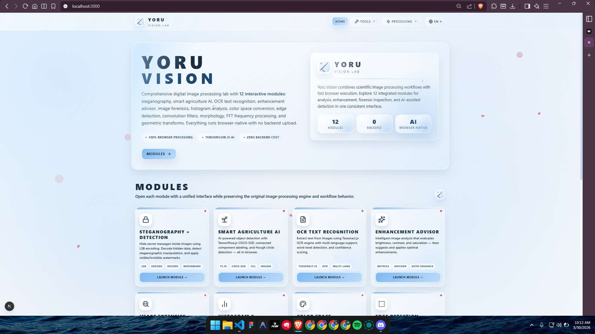
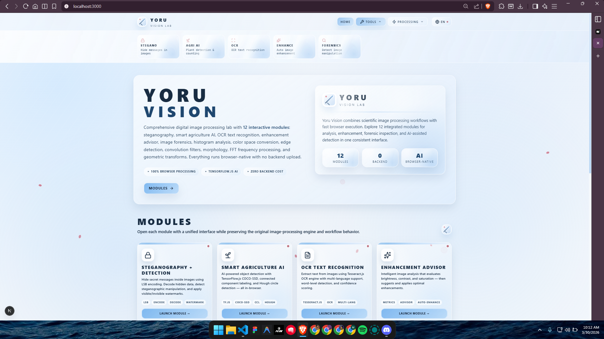
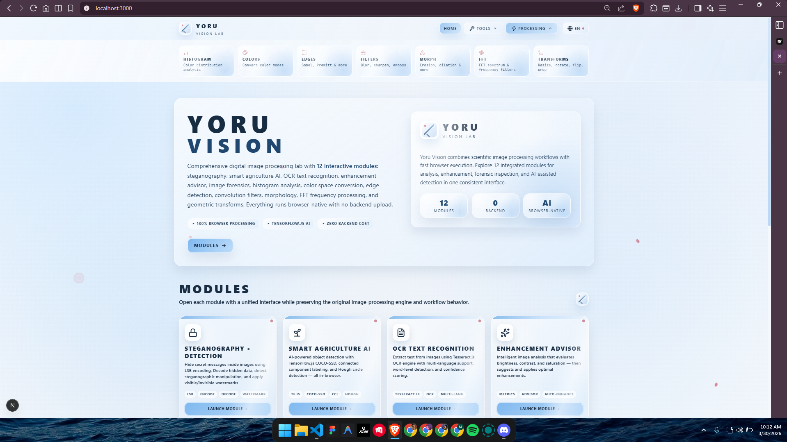
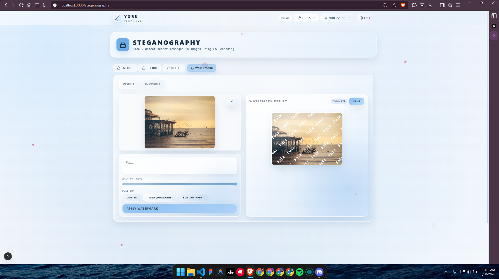
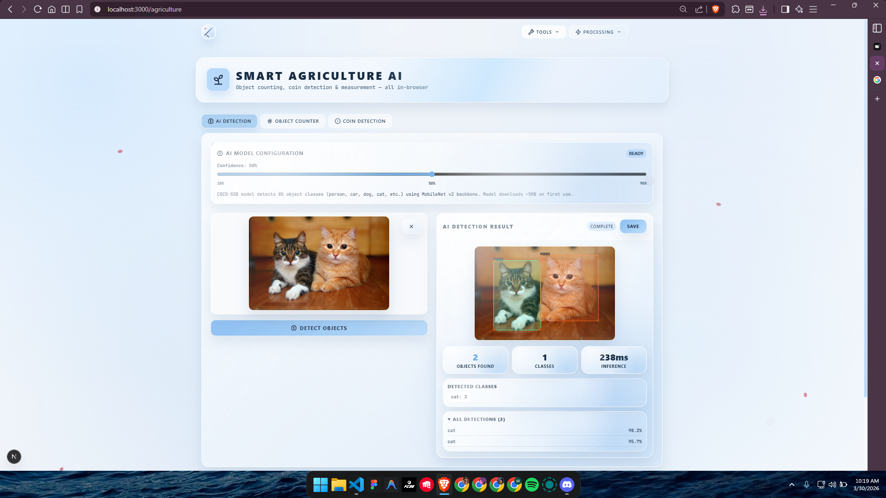
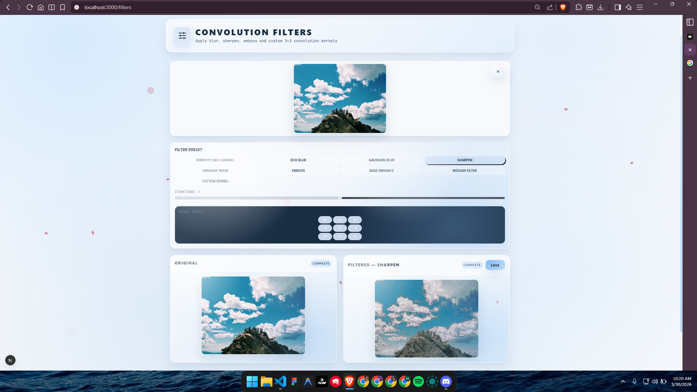
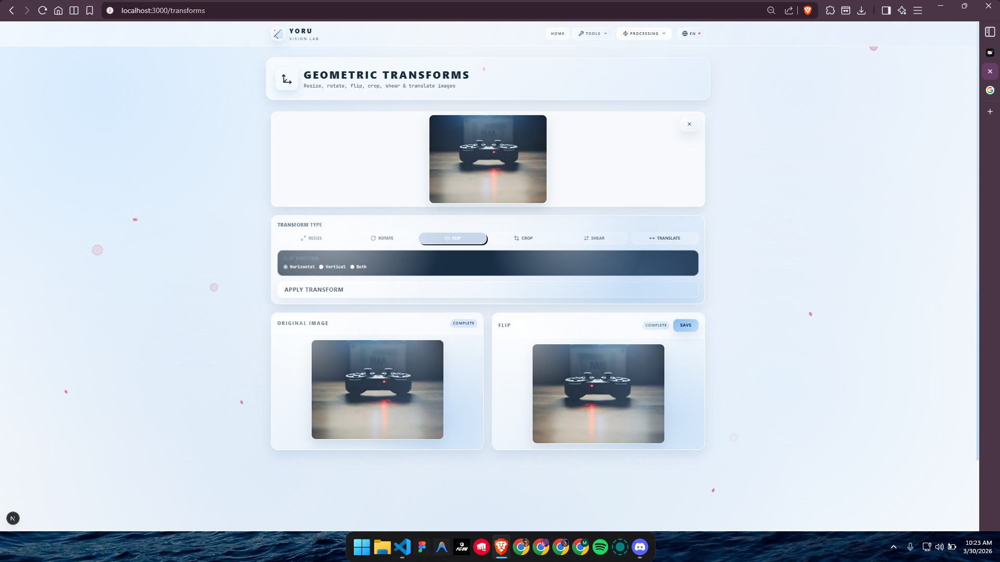
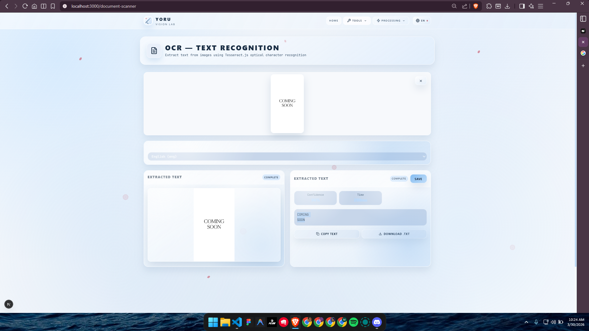

# Yoru Vision

### Website Implementasi Mata Kuliah Pengolahan Citra

Yoru Vision adalah proyek website interaktif yang dibangun untuk mengimplementasikan konsep-konsep inti pada mata kuliah Pengolahan Citra Digital. Seluruh proses dilakukan langsung di browser, sehingga mahasiswa dapat mencoba algoritma secara visual tanpa perlu setup backend.

---

## Kenapa Proyek Ini Dibuat

Pada pembelajaran Pengolahan Citra, teori seperti histogram, filtering, segmentasi, transformasi geometri, OCR, hingga analisis forensik sering kali sulit dipahami jika hanya dilihat dari rumus. Website ini dibuat untuk menjembatani teori dan praktik melalui simulasi yang bisa langsung diuji pada gambar nyata.

Output yang diharapkan:

- Mahasiswa memahami hubungan antara parameter algoritma dan hasil citra.
- Mahasiswa dapat membandingkan beberapa metode dalam satu platform yang sama.
- Mahasiswa memiliki media praktikum berbasis web yang ringan dan mudah dipakai.

---

## Cakupan Materi Pengolahan Citra yang Diimplementasikan

| Topik Mata Kuliah          | Implementasi di Website                                     | Rute                |
| -------------------------- | ----------------------------------------------------------- | ------------------- |
| Peningkatan kualitas citra | Brightness, contrast, saturation, sharpening advisor        | `/enhancement`      |
| Analisis histogram         | RGB/luminance histogram dan equalization                    | `/histogram`        |
| Ruang warna                | Konversi RGB, HSL, CMYK, grayscale, binary, sepia           | `/color-space`      |
| Deteksi tepi & fitur       | Sobel, Prewitt, Laplacian, Roberts, Canny, Harris           | `/edge-detection`   |
| Filtering spasial          | Blur, sharpen, emboss, edge enhance, median, custom kernel  | `/filters`          |
| Morfologi citra            | Erosion, dilation, opening, closing, top-hat, black-hat     | `/morphology`       |
| Transformasi geometri      | Resize, rotate, flip, crop, shear, translate                | `/transforms`       |
| Domain frekuensi           | FFT 2D, low-pass, high-pass, band-pass                      | `/fft`              |
| OCR dokumen                | Ekstraksi teks berbasis Tesseract.js                        | `/document-scanner` |
| Steganografi               | LSB encode/decode, watermark, stego detection               | `/steganography`    |
| Computer vision terapan    | Deteksi objek AI, counting, hough circle, template matching | `/agriculture`      |
| Forensik digital           | ELA, noise analysis, blur map, EXIF metadata                | `/forensics`        |

---

## Preview Antarmuka (8 Screenshot)

> Berikut 8 screenshot aplikasi sebagai gambaran tampilan dan variasi modul.

| Preview 1             | Preview 2             |
| --------------------- | --------------------- |
|  |  |

| Preview 3             | Preview 4             |
| --------------------- | --------------------- |
|  |  |

| Preview 5             | Preview 6             |
| --------------------- | --------------------- |
|  |  |

| Preview 7             | Preview 8             |
| --------------------- | --------------------- |
|  |  |

---

## Alur Praktikum Singkat

1. Pilih salah satu modul sesuai topik perkuliahan.
2. Upload gambar sendiri atau gunakan gambar contoh.
3. Atur parameter algoritma (threshold, kernel, radius, dsb).
4. Amati perubahan output secara langsung.
5. Unduh hasil untuk dokumentasi laporan praktikum.

---

## Teknologi yang Digunakan

- Next.js 16
- React 19
- TypeScript 5
- Tailwind CSS v4
- TensorFlow.js + COCO-SSD (modul AI)
- Tesseract.js (modul OCR)

Mayoritas algoritma pengolahan citra diimplementasikan manual menggunakan Canvas API dan TypeScript agar alurnya tetap edukatif dan mudah ditelusuri.

---

## Menjalankan Proyek Secara Lokal

```bash
npm install
npm run dev
```

Setelah server berjalan, akses:

```text
http://localhost:3000
```

---

## Struktur Inti Proyek

```text
src/
  app/         -> Halaman tiap modul (routing)
  features/    -> Logika per modul (lib, hooks, ui)
  shared/      -> Komponen umum dan i18n
public/
  examples/    -> Dataset gambar contoh
```

---

## Catatan Akademik

Proyek ini ditujukan sebagai media pembelajaran dan demonstrasi implementasi konsep Pengolahan Citra Digital pada platform web. Untuk evaluasi akademik, setiap modul dapat dijadikan bahan analisis perbandingan metode, pengujian parameter, dan interpretasi kualitas hasil.

---

## Identitas Proyek

- Nama Proyek: Yoru Vision
- Domain: Pengolahan Citra Digital
- Bentuk Implementasi: Website interaktif berbasis browser
